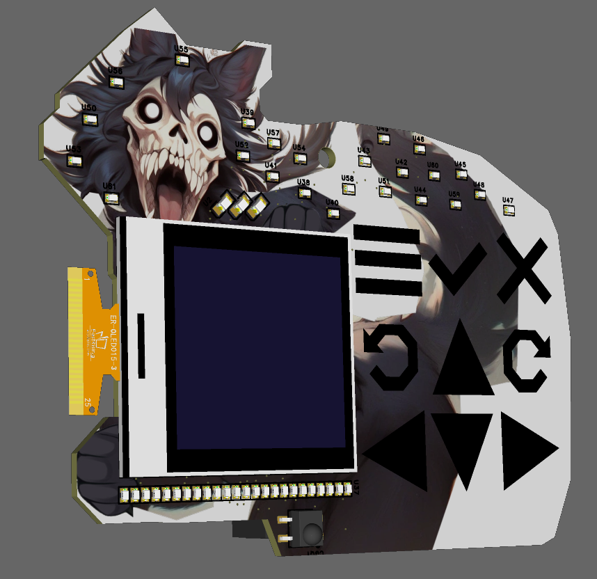

- Overview

This page contains the code and design files used to create the SCP-1471-A MalO Simple Add-On (SAO).  These units will be sold online and handed out at DEFCON in August 2026.

As part of the standard DEFCON experience, each attendee receives a circuit board they wear around their neck that serves both as a multi-day ticket for the con and as a platform to show off hardware/software hacks.  These MalO SAOs plug into the expansion port on the official con badge to allow the user to customize their standard DEFCON badge.

Among other things, these MalO units will have a screen and buttons to allow the user to play games, unlock puzzles, display screen savers, view messages, etc.  The devices can communicate with one another over infrared.  There are dozens of LEDs.  The units have a USB port so users can hack them with Python.

Work in progress render (not final artwork)

- User Guide

git clone git@github.com:parallellogic-/MalO_SAO.git
git submodule update --init --recursive

- Resources

- Credits

- BOM

vibration motor https://jlcpcb.com/partdetail/KOTL-Z3OC1T8219731/C2894731
processor https://jlcpcb.com/partdetail/RaspberryPi-RP2350B/C42415655

