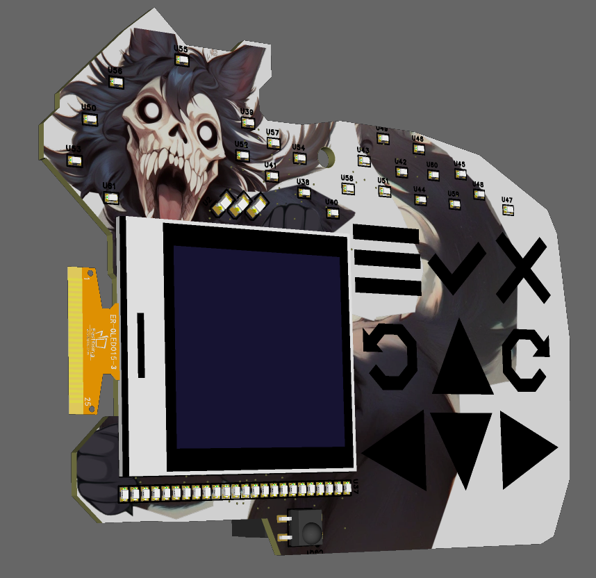

# Overview

This page contains the code and design files used to create the SCP-1471-A MalO Shitty Add-On (SAO).  These units will be sold online and handed out at DEFCON34 in August 2026.

As part of the standard DEFCON experience, each attendee receives a circuit board they wear around their neck that serves both as a multi-day ticket for the conference and as a platform to show off hardware/software hacks.  These MalO SAOs plug into the expansion port on the official conference badge to allow the user to customize their standard DEFCON badge.

Among other things, these MalO units have a screen, LEDs and buttons to allow the user to play games, unlock puzzles, display screen savers, view messages, etc.  The devices can communicate with one another over infrared and Near Field Communication.  The units have a USB port where users can hack them with Python.

- SCP-1471-A, MalO v1.0.0, Lore
    - [Video](https://www.youtube.com/watch?v=Qe8of66Nkio)
    - [Wiki](https://scp-wiki.wikidot.com/scp-1471)

Work in progress render (not final artwork)

# User Guide

- Thonny editor for hacking Python on Core0
    - https://thonny.org/
    - File upload/download, .py file editing and IDE
- git clone git@github.com:parallellogic-/MalO_SAO.git

git submodule update --init --recursive

# Hardware

- Processor, [RP2350B](doc/spec_sheets/Processor_RP2350B_C42415655.pdf), [C42415655](https://jlcpcb.com/partdetail/RaspberryPi-RP2350B/C42415655)
    - A3/A4 revision resolves E9 current leakage, enabling capacitive touch
    - 150 MHz
    - Unique ID (username)
    - Internal temperature sensor
- Memory Flash, [W25Q128JVSIQ](doc/spec_sheets/Memory_Flash_W25Q128JVSIQ_C113767.pdf), [C113767](https://jlcpcb.com/partdetail/WinbondElec-W25Q128JVSIQ/C113767)
    - 16 MB
- USB-C, [TYPE-C 16P QTWT](doc/spec_sheets/USB_C5187472.pdf), [C5187472](https://jlcpcb.com/partdetail/SHOUHAN-TYPE_C_16PQTWT/C5187472)
    - v1.1, 12 Mbps
- 3V3/5V LDO Regulator, [LD1117-3.3](doc/spec_sheets/LDO_LD1117-3.3_C347229.pdf), [C347229](https://jlcpcb.com/partdetail/323889-LD1117_33/C347229)
    - Rated >500 mA
    - Dissipates 170 mW at 100 mA load
- Capacitive Touch
    - 1 MOhm to PWM
- Buzzer, [MLT-7525](doc/spec_sheets/Buzzer_MLT-7525_C95299.pdf), [C95299](https://jlcpcb.com/partdetail/Jiangsu_HuanengElec-MLT7525/C95299)
    - 100 Hz-10 kHz, peak 2.7kHz
- Microphone, [LMD2718T261-OA1](doc/spec_sheets/Microphone_LMD2718T261-OA1_C5373237.pdf), [C5373237](https://jlcpcb.com/partdetail/LinkMems-LMD2718T261OA1/C5373237)
    - -26 dB sensitivity, 58 dB SNR
- Hall Effect Sensor, [HAL403SO](doc/spec_sheets/Hall_Effect_Sensor_HAL403SO_C42387470.pdf), [C42387470](https://jlcpcb.com/partdetail/Hallwee-HAL403SO/C42387470)
    - +/-50 mT
- IR TxD, [XL-2012IRC-940](doc/spec_sheets/IR_TxD_XL-2012IRC-940_C965889.pdf), [C965889](https://jlcpcb.com/partdetail/XINGLIGHT-XL_2012IRC940/C965889)
    - Per LED: 940 nm, 38 kHz PWM (software-defined), 30mA, 2mW/sr, 120° FOV
    - 1x LED default, solder jumper to enable 2 additional IR LEDs (to triple brightness)
- IR RxD, [IRM-H638T/TR2](doc/spec_sheets/IR_RxD_IRM-H638T-TR2_C91447.pdf), [C91447](https://jlcpcb.com/partdetail/EverlightElec-IRM_H638TTR2/C91447)
    - 38 kHz PWM (hardware-defined), 940 nm, 45° FOV
- \[REDACTED\], [LTR-308ALS-01](Light_Sensor_LTR-308ALS-01_C492382.pdf), [C492382](https://jlcpcb.com/partdetail/LiteOn-LTR_308ALS01/C492382)
    - 0.01-157 klux
- IMU, [LSM6DS3TR](doc/spec_sheets/), [C95230](https://jlcpcb.com/partdetail/STMicroelectronics-LSM6DS3TR/C95230)
    - 6DOF: Accelerometer + Gyroscope
    - Internal temperature sensor
- Screen, [ER-OLED015-3W](doc/spec_sheets/Screen_ER-OLED015-3_Datasheet.pdf), [BuyDisplay](https://www.buydisplay.com/white-1-5-inch-grayscale-oled-display-panel-128x128-i2c-serial-spi)
    - SSD1327 driver interface
    - 128*128 px, 1.5" diagonal
    - 4-bit (16-level grayscale), neighboring pixels (2 nibbles) combined into byte
- SAO header, [PZ254V-12-6P](doc/spec_sheets/SAO_header_PZ254V-12-6P_C492420.pdf), [C492420](https://jlcpcb.com/partdetail/XFCN-PZ254V_126P/C492420)
    - 2 rows, 6 pins, 100 mil, through hole, male
- Potentiometer, [TC33X-2-103E](doc/spec_sheets/Potentiometer_TC33X-2-103E_C719176.pdf), [C719176](https://jlcpcb.com/partdetail/BOURNS-TC33X_2103E/C719176)
    - 10 kOhms
- Vref, [LM385DBZ-1.2RG](doc/spec_sheets/Vref_LM385DBZ-1.2RG_C5145284.pdf), [C5145284](https://jlcpcb.com/partdetail/5767651-LM385DBZ_12RG/C5145284)
    - 1.24V
- RFID, [ST25DV04K-IER6C3](doc/spec_sheets/RFID_ST25DV04K-IER6C3_C2908287.pdf), [C2908287](https://jlcpcb.com/partdetail/STMicroelectronics-ST25DV04KIER6C3/C2908287)
    - 13.56 MHz
    - Energy harvesting (LED)
- Red-Green LED, [XL-1608SURUGC](doc/spec_sheets/LED_XL-1608SURUGC_C5349934.pdf), [C5349934](https://jlcpcb.com/partdetail/XINGLIGHT-XL1608SURUGC/C5349934)
- N-MOSFET, [L2N7002SLLT1G](doc/spec_sheets/N-MOSFET_L2N7002SLLT1G_C22446827.pdf), [C22446827](https://jlcpcb.com/partdetail/LRC-L2N7002SLLT1G/C22446827)
    - For motor, IR TxD, buzzer
- Diode, [1N5819WS](doc/spec_sheets/Diode_1N5819WS_C191023.pdf), [C191023](https://jlcpcb.com/partdetail/GuangdongHottech-1N5819WS/C191023)
    - For motor, buzzer, +15V
- +15V Boost, [MT3540-F23](doc/spec_sheets/15V_Boost_MT3540-F23_C181783.pdf), [C181783](https://jlcpcb.com/partdetail/XI_AN_AerosemiTech-MT3540F23/C181783)
    - For screen

# Software

- Core0
    - User-configurable Python scripts
- Core1
    - Compiled C library

# Resources

- Schematic
- [DEFCON34 SAO MICD](https://www.reddit.com/r/Defcon/comments/1tj1jv3/def_con_34_badge_alert/)
    - Note: installed upside-down from standard
    - 100 mA maximum current draw
    - 3.0V power supply
- [SAO generic standard](https://hackaday.io/project/175182-simple-add-ons-sao)

# Credits

- PCB Artwork, Stickers, Promotional Artwork
    - [HotGlewd](http://hotglewd.com)
- Pixel Artwork
    - [BitAssembly](https://bitassembly.itch.io/)
- CCA schematic & layout
    - [ParallelLogic](https://github.com/parallellogic-)

# License

[![CC BY-SA 3.0][cc-by-sa-shield]][cc-by-sa]

This work is licensed under a [Creative Commons Attribution-ShareAlike 3.0 Unported License][cc-by-sa].

[cc-by-sa]: http://creativecommons.org
[cc-by-sa-shield]: https://shields.io
