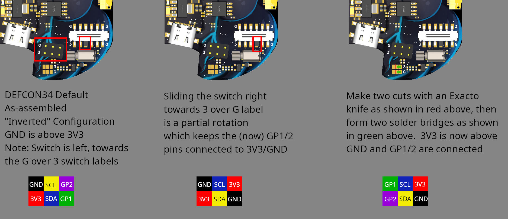
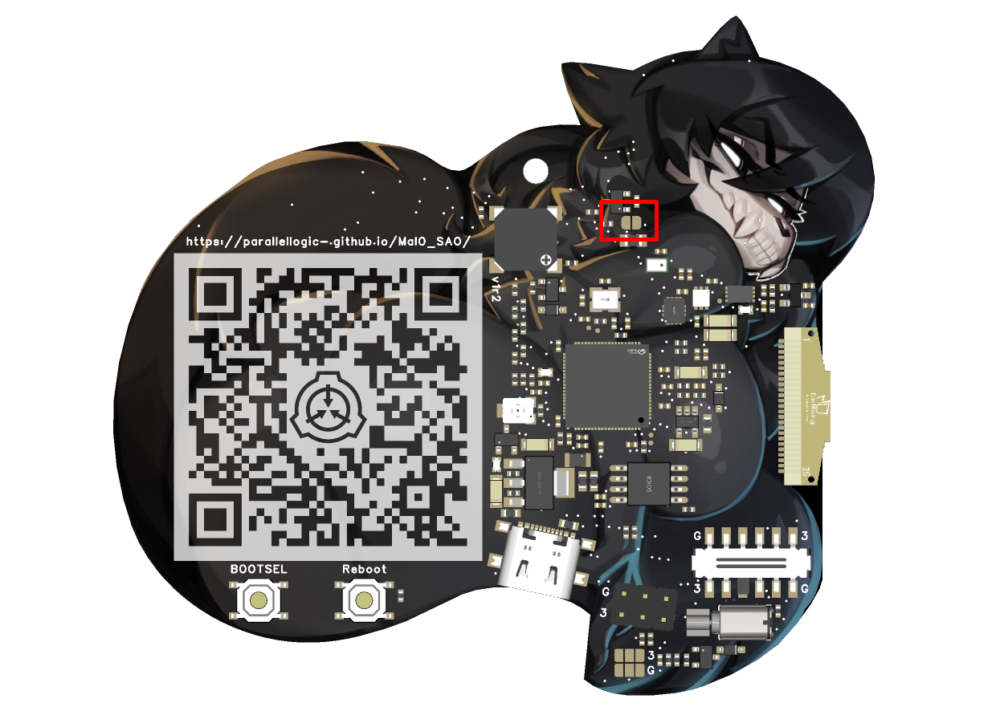
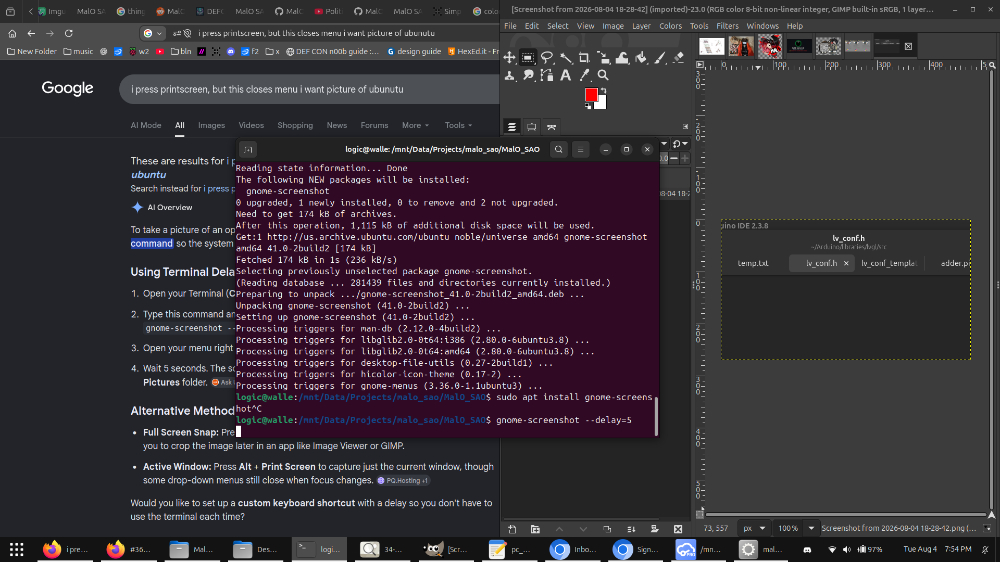

# Overview

If you encounter any issues or would like any additional clarification, please file an issue ticket [here](https://github.com/parallellogic-/MalO_SAO/issues).

This documentation will cover the following topics:
- How to perform a factory reset
- Blinking an LED
- Compiling the application software
- Adding a new LED pattern

# Factory Reset

Some users have reported the following issues:
- Animations are black (except for text along the bottom like "Chilly") or incomplete (only part of the animation frame is visible)
- Units become stuck in Demo mode (alternating between an animation and full-screen text, and otherwise non-responsive to user input)
- Missing IR send.csv file

The following steps will resolve the above issues (the entire process should take ~5 minutes):
1. Connect the device to your computer using a Data USB-C cable (power-only cables are insufficient)
1. Press AND HOLD the "BOOTSEL" button on the back of the device
1. While keeping the "BOOTSEL" button pressed, tap the "Reboot" button
1. Release the "BOOTSEL" button
1. The device will appear as a USB mass storage device "RP2350" containing files "INDEX.HTM" and "INFO_UF2.TXT"
1. Copy the following .uf2 file adjacent to "INFO_UF2.TXT": [universal_flash_nuke.uf2](/src/universal_flash_nuke.uf2)
1. The device will promptly disappear from your list of connected devices
1. Roughly one minute later, the speaker will click 3 times
1. The device will re-appear as a connected device "RP2350"
1. Copy the following .uf2 file adjacent to "INFO_UF2.TXT": [malo.uf2](/src/malo.ino.uf2)
1. Once the file has completed upload, tap the "Reboot" button.  The device will begin vibrating loudly (it may proceed to this state without tapping the "Reboot" button)
1. Tap the "Reboot" button again.  The device is now in normal operation
1. On the MalO SAO, navigate to "Settings"
1. Navigate to "Mount USB" and press the "check" key.  The red LED on the rear of the device will begin flashing at regular intervals
1. A new drive will appear on your computer
1. Navigate inside the new drive, you should see no contents
1. Copy the two folders "animations" and "data" from here into the Flash drive: [flash](/src/malo/flash)
1. Observe the red LED on the back of the device begins flickering erratically for approximately one minute
1. There are now two folders "animations" and "data" on the MalO SAO
1. Safely dismount the device from your computer
1. Power cycle the device by tapping the "Reboot" button
1. The MalO SAO has now been factory reset

# Hardware Setup

## SAO Port 180 Degree Rotation

The DEFCON34 SAO port is mounted 180 degrees rotated from the [traditional specification](https://hackaday.io/project/175182-simple-add-ons-sao).  To allow for this badge to work with the DEFCON34 badge AND badges from other conferences without the need to mount it upside down or require an adapter, a quick-access switch has been installed to rotate 4 of the 6 pins.  The additional 2 pins can be rotated by cutting two jumpers and forming two solder joints.  In the majority of cases (ex for badges that do not use/connect the GPIO pins), simply sliding the switch is sufficient to switch the MalO SAO between inverted and non-inverted configurations.



## InfraRed Boost

By default the DEFCON34 badge is power-limited to 100 mA shared between the two available SAO ports.  The MalO is fitted with InfraRed LEDs that transmit at up to 90 mA, but these are configured to only 30 mA by default to comply with the badge power limitation.  To triple the default transmit power to maximum, solder this jumper closed



# Software Setup

## Integrated Development Environment

### Arduino IDE

Download and install the latest Arduino IDE as explained [here](https://www.youtube.com/watch?v=SX8z3-BEuWQ)

### Hardware

In Arduino IDE:
File >> Preferences >> "Additional board manager URLs"
paste in the following URL to add RP2040 support:
https://github.com/earlephilhower/arduino-pico/releases/download/global/package_rp2040_index.json

Restart the IDE

Go to the "Boards Manager" (of the fiver vertical icons on the left of the screen, it is the second one down)
type "philhower"
click "Install" for the single search hit

### Libraries

In Arduino IDE, go to the "Manage Libraries" ( Ctrl+Shift+I ) screen.  Install the following:
- "lvgl" by kisvegabor

Make a copy of this file:
[/src/malo/support/lv_conf.h](/src/malo/support/lv_conf.h)
inside your lvgl scr folder:
~/Arduino/libraries/lvgl/src/

# Demos

Note: compiling and uploading new firmware to the MalO SAO will wipe any existing content up to and possibly including the file system.  This will not damage the hardware, but may lose any files that have been uploaded to the device.  In the production application, these can be re-uploaded by setting the MalO SAO device into USB mass storage mode: Settings >> Mount USB, and then copying these files into the USB device: [files](/src/malo/flash_extended/).  Upload may take a minute or so, ensure to safely dismount the device before disconnecting.

The processor used in project can be rebooted by pressing the "Reboot" button on the rear of the device.  It is possible that the device gets hung up or is otherwise non-response.  In these cases, press and hold down the "BOOTSEL" button and then tap the "Reboot" button.  In BOOTSEL mode the device will enumerate as a uf2 USB slave.  From here you can drag and drop uf2 files into it as if it were a USB mass storage drive.  In this case the [flash_nuke2.uf2](/src/universal_flash_nuke.uf2) can be uploaded to clear the entire processor's back to factory settings, ready for new file upload in BOOTSEL mode.  Uploading this uf2 may take a minute or so before the buzzer chitters to acknowledge completion. 

Use the following settings in the Arduino IDE:



## Blink LED

Open this Arduino sketch:
[/src/experimentation/blink/blink.ino](/src/experimentation/blink/blink.ino)

Press Ctrl+U to compile and upload the sketch to the MalO SAO

The green LED will blink.  Refer to the left side of page 1 of the [schematic](r2/schematic.pdf) for more information about the pins connected to the processor:

## Build Production

Open this Arduino sketch:
[/src/malo/malo.ino](/src/malo/malo.ino)

Press Ctrl+U to compile and upload the sketch to the MalO SAO

## Adding LED Pattern

Look for the `animation_static_red` method in the led.ino file.  Add the following new method below it:
```
void Charlieplex::animation_static_yellow(SensorSuite &sensor_suite)
{
    set_max_effective_led_count(CHARLIPLEX_LED_COUNT/2);
    for (uint8_t iter = 0; iter < CHARLIPLEX_LED_COUNT; iter++) set_brightness(iter,128);
}
```

In the array at the top, add the string and method name:
```
const AnimationMapping animation_table[] = {
...
{"Static Yellow",      &Charlieplex::animation_static_yellow},
...
};
```

Press Ctrl+U to compile and upload the sketch to the MalO SAO.  The new LED pattern will appear in Animations >> LED Upper >> Static Yellow 
